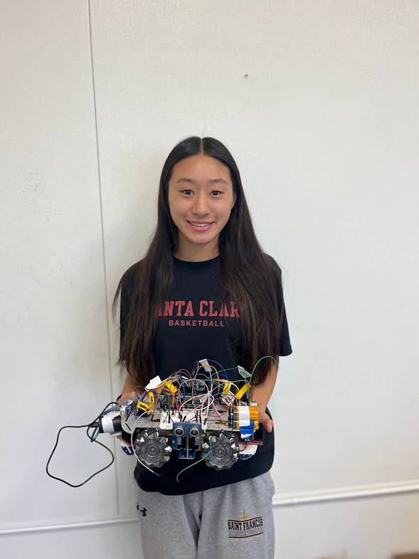
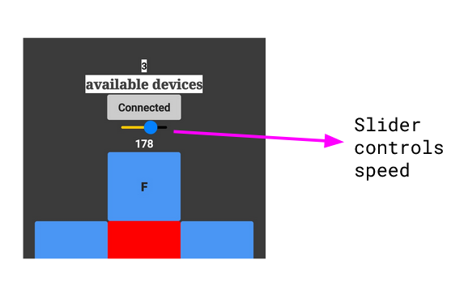
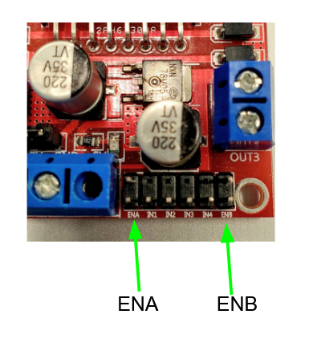
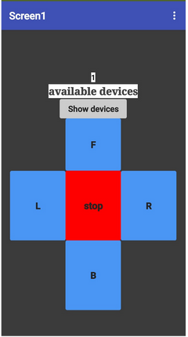
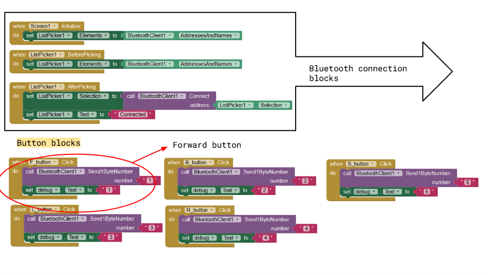
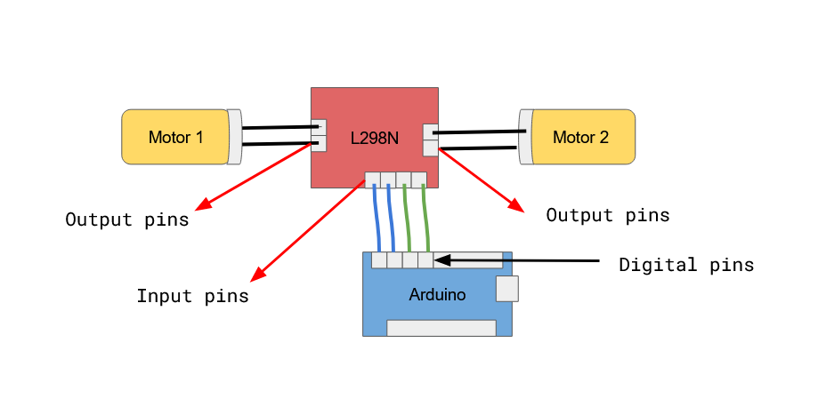
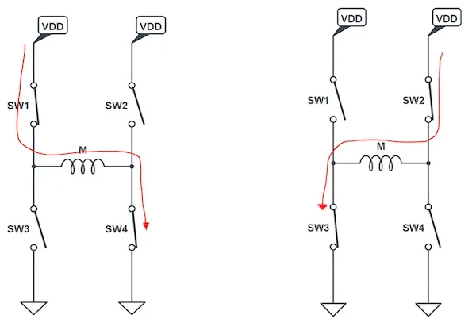

# Omniwheel
The omniwheel will be able to move in any direction: forward, backward, right, left, and even diagonally! Not only will it be able to move but also avoid obstacles in its way. Its wheels allow this "car" to move anywhere and avoid anything. 

<!---You should comment out all portions of your portfolio that you have not completed yet, as well as any instructions:
```HTML 
<!--- This is an HTML comment in Markdown -->
<!--- Anything between these symbols will not render on the published site 
```-->

| **Engineer** | **School** | **Area of Interest** | **Grade** |
|:--:|:--:|:--:|:--:|
| Kayla L | Saint Francis | Electrical Engineering | Incoming Senior

<!---**Replace the BlueStamp logo below with an image of yourself and your completed project. Follow the guide [here](https://tomcam.github.io/least-github-pages/adding-images-github-pages-site.html) if you need help.**
-->


# Modifications

 

  
# Third Milestone

<iframe width="560" height="315" src="https://www.youtube.com/embed/dl-xJggks3I?si=8PqJib2aKTDHVeEg" title="YouTube video player" frameborder="0" allow="accelerometer; autoplay; clipboard-write; encrypted-media; gyroscope; picture-in-picture; web-share" referrerpolicy="strict-origin-when-cross-origin" allowfullscreen></iframe>

<!--For your final milestone, explain the outcome of your project. Key details to include are:
- What you've accomplished since your previous milestone
- What your biggest challenges and triumphs were at BSE
- A summary of key topics you learned about
- What you hope to learn in the future after everything you've learned at BSE-->

## Summary

In my third milestone, I integrated speed controls into my app. In MIT App Inventor, the slider controls the amount of power the motors receive. I can adjust the power by moving the slider left and right.



**Figure 1**: The slider controls how much power the motors receive. When moved to the left, the speed decreases. When moved to the right, the speed will increase.

I was able to control the speed by using the enable pins on the motor driver. For example, ENA controls motor 1 while ENB controls motor 2.



**Figure 2**: ENA and ENB pins are placed next to the input pins. ENA controls OUT2 while ENB controls OUT3, each of which carries power to their respective motors.

I connected those enable pins to PWM digital pins. Pulse Width Modulation (PWM) is used as a way to control the power delivered by an electric signal. Using PWM pins, I am able to use analogWrite to control the amount of power given to the motors. This allows me to be more specific with how fast the motor will move. The duty cycle of PWM is the relative amount of time the signal is ON or OFF and uses that average as a value. It is the ratio of time a circuit is ON compared to the time the circuit is OFF. However, the parameters of the PWM pins can only read values between 0 and 255. So 255 is the duty cycle of 1 and 0 is the duty cycle of 0. I set my max value to 250 and my min to 50. In the duty cycle, 250 would be 98% and 50 would be 19%.

Below is a snippet of the code controlling speed:
```c++
 default:
    if ((command >= 50) & (command <= 250)); {
      Setspeed(command);
    }
    break;
  }
}

void Setspeed(int speed) {
  analogWrite(motor3ena, speed);
  analogWrite(motor4enb, speed); 
  analogWrite(motor1enb, speed);
  analogWrite(motor2ena, speed);
}
```
A challenge I had was figuring out if the Arduino was actually receiving the commands from the app. Since I used all the digital pins in the Arduino, including the RX and TX pins, I couldn't see if the Arduino was actually receiving commands from the app. I had to move some of my other wires to analog pins and convert those to digitalWrite code in order to see if the Bluetooth connection was working through the serial monitor. Another issue I had was the amount of power going to the motor drivers wasn’t enough. Even though the serial monitor showed that the Arduino was receiving and carrying out the commands, it didn’t physically carry out the action. I checked the continuity and voltage and realized the motor drivers needed more power. I also changed the power source for the Arduino because last time I realized I was supplying too many watts to the Arduino.
Next, I will be adding modifications to the Omni-Wheel Robot. I plan to add ultrasonic sensors at the front, back, and sides to detect objects. When the object is detected, the Omni-Wheel should stop. I also want to add LEDs that will light up when an object is detected.

Overall, my time at Bluestamp was really enjoyable. I came into Bluestamp knowing nothing and walking away, I am more confident in the new skills I've learned. I was even able to learn how to code, which is something I've been wanting to learn before coming to Bluestamp. I had some pretty big challenges with my project, however, since I had no expereince. It was hard to code my robot and create an app. It was especially hard to connect those together through Bluetooth. After a lot of research and tests, I was finally able to figure it out. The Bluetooth was a pretty major part of my project and I thought figuring out that part was a big triumph. Now that I have all these new skills and knowledge, I want to continue learning by doing more independent projects in the future.


# Second Milestone

<iframe width="560" height="315" src="https://www.youtube.com/embed/qqzZYsTm-Aw?si=jJB6KwS7av_UeXb4" title="YouTube video player" frameborder="0" allow="accelerometer; autoplay; clipboard-write; encrypted-media; gyroscope; picture-in-picture; web-share" referrerpolicy="strict-origin-when-cross-origin" allowfullscreen></iframe>

## Summary
For my second milestone, I built an app that can control the Omni-Wheel Robot remotely through Bluetooth. Using the MIT app inventor, my app can control if Omni-Wheel moves forwards, backwards, left, right, and stops.



**Figure 1**: The app connects to the robot through Bluetooth. After the user clicks “Show devices”,  they can select their Bluetooth, then go back to this screen to control direction through the buttons: F, L, R, B, and S.  

The app connects to the Arduino through the Bluetooth module [HC-05](https://components101.com/wireless/hc-05-bluetooth-module). The buttons pressed on the app are commands sent to the Arduino. Those app commands are assigned a number. For example, forward is 1 and stop is 5. Each number correlates to a function in the Arduino. The Arduino processes the data in a similar manner: when the Arduino reads the number 1, it knows to use the function, forward. 

 
 
 **Figure 2**: These blocks are what makes the app work. When I press F, it sends the number 1 to the Bluetooth which is sent to the Arduino, calling the function, forward. 

A challenge was the initial connection between the Bluetooth and phone. It took awhile to find the right HC-05 module to connect to. Another issue with the Bluetooth was connecting it to the Arduino and app. I could not figure out if the Arduino was actually receiving commands from the app. I had to use mySerial software so I could see if the commands were actually being read through Bluetooth. I also used Serial.print to see if the commands were received and carried out. So if I pressed F on the app, the serial monitor would print out “go forward” if it read and carried out the command. Although the Bluetooth connection was good and the monitor said it was carrying out the command, the robot still would not move. 

See below an Arduino code snippet of communication between the app and Arduino. 

```c++
void loop() {
// 
  if (bluetooth.available() > 0) {
    command = bluetooth.read();
    Serial.println(command);
  }
  switch (command) {
  case 1:
    forward();
    Serial.println("go forward");
    break;
  case 2:
    backward();
    Serial.println("go backward");
    break;
  case 3:
    left();
    Serial.println("go left");
    break;
  case 4:
    right();
    Serial.println("go right");
    break;
  case 5:
    stop();
    Serial.println("STOP");
    break;
  default:
        break;
  }
}
```
After checking its power and connectivity, I realized Robot needed more power and added another 9V to power the motor drivers. By adding extra power, the motors finally worked and followed the commands sent out by the app. Next, I will change up how much power each motor receives and allow it to make turns. I also want to change the Arduino’s power source and lower the amount of Watts used. 


# First Milestone

<iframe width="560" height="315" src="https://www.youtube.com/embed/BwnA2dhK-hY?si=z6W67eEtSvusYkwm" title="YouTube video player" frameborder="0" allow="accelerometer; autoplay; clipboard-write; encrypted-media; gyroscope; picture-in-picture; web-share" referrerpolicy="strict-origin-when-cross-origin" allowfullscreen></iframe>

<!---For your first milestone, describe what your project is and how you plan to build it. You can include:
- An explanation about the different components of your project and how they will all integrate together
- Technical progress you've made so far
- Challenges you're facing and solving in your future milestones
- What your plan is to complete your project
-->
## Summary
My project is the Omni-Wheel Robot. For my first milestone, I assembled the car together and made all 4 wheels move forward at the same speed. Each wheel has its own motor. The front two wheels are connected to one motor driver and the back two are connected to another motor driver. The motor driver I am using is the L289N model. This motor driver can amplify electrical signals to power, control the motor and enable speed control.  


See resource link 1

  

**Figure 1**: Overview of motor control system for this milestone. Each motor is a DC motor and the L298N is a motor driver. The blue input pins control direction for motor 1 and the green input pins control direction for motor 2.

There are 2 output pins on each side called the output pins. Those pins are connected to the motors and give them power. The 4 input pins that connect to the Arduino receive the signal to move the motors in a forward or backward direction. As seen in **Figure 1**, the blue pins control direction for motor 1 and the green pins control direction for motor 2. The blue pins are called input 1 and input 2, the green pins are called input 3 and input 4. If input pin 1 is “LOW” and input pin 2 is “HIGH”, motor 1 would move in a forward direction. If input pin 1 was “HIGH” and vice-versa, motor 1 would move in the opposite direction, backwards. It works the same way for input pins 3 and 4. If input pin 3 is “LOW” and input pin 4 is “HIGH”, motor 2 would move forwards. If the state of the pins were switched, motor 2 would move backwards. It works this way because the motor driver uses an H-bridge circuit. An H-bridge circuit has 4 switches that can be opened and closed. 



**Figure 2**: H-bridge circuit overview. SW stands for switch. (Left) Current flows from switch 1 to 4. (Right) Current flows from switch 2 to 3, opposite to the left. Therefore, the motor in the right would move in an opposite direction as the left, according to the current’s flow. 

See resource link 2

If pins 1 and 3 were switched on, the switch would be open for pins 2 and 4; this follows the command “LOW” and “HIGH”. Input pins 2 and 4 would be “HIGH” making those motors move forward. If the switch were closed for input pins 2 and 4, then input pins 1 and 3 would be open. The motors would then move backward. See code below:

## Code

```c++
int motor1pin1 = 5;
int motor1pin2 = 4;
int motor2pin1 = 3;
int motor2pin2 = 2;

int motor3pin1 = 6;
int motor3pin2 = 7;
int motor4pin1 = 8;
int motor4pin2 = 9;

void setup() {
     pinMode(motor1pin1, OUTPUT);
   pinMode(motor1pin2, OUTPUT);
   pinMode(motor2pin1, OUTPUT);
   pinMode(motor2pin2, OUTPUT);

  pinMode(motor3pin1, OUTPUT);
  pinMode(motor3pin2, OUTPUT);
  pinMode(motor4pin1, OUTPUT);
  pinMode(motor4pin2, OUTPUT);
}

void loop() {
   digitalWrite(motor1pin1, HIGH);
   digitalWrite(motor1pin2, LOW);
   digitalWrite(motor2pin1, HIGH);
   digitalWrite(motor2pin2, LOW);

  digitalWrite(motor3pin1, LOW);
  digitalWrite(motor3pin2, HIGH);
  digitalWrite(motor4pin1, LOW);
  digitalWrite(motor4pin2, HIGH);
}

```
So far, I've only made the car move forward, but could change it to move backward later. I also added 5 batteries, which add to about 7.5 V so that the motors would get enough power to move all four wheels at the same speed. At first, the motors were not getting enough power since all the power was from the arduino which has a limit of 5 V. The motors each need about 2 V or less, so the batteries provided enough power for all of them. Later, I plan to put ultrasonic detectors around the robot so it can detect objects in its way, stop, and move around it. Through this first milestone, I learned how the motor drivers work, how to code a bit more, and the path of electricity in my circuit.


## Schematics 


# Bill of Materials
<!---Here's where you'll list the parts in your project. To add more rows, just copy and paste the example rows below.
Don't forget to place the link of where to buy each component inside the quotation marks in the corresponding row after href =. Follow the guide [here]([url](https://www.markdownguide.org/extended-syntax/)) to learn how to customize this to your project needs. -->

| **Part** | **Note** | **Price** | **Link** |
|:--:|:--:|:--:|:--:|
| Arduino | Code robot | $48.40 | <a href="https://store-usa.arduino.cc/products/arduino-mega-2560-rev3?selectedStore=us"> Link </a> |
| Motor driver  | Powering the motors | $7.00 | <a href="https://store-usa.arduino.cc/products/l298-driver-for-dc-stepper-motors"> Link </a> |
| HC-05 | bluetooth module | $9.99 | <a href="https://www.amazon.com/Arduino-A000066-ARDUINO-UNO-R3/dp/B008GRTSV6/](https://www.amazon.com/DSD-TECH-HC-05-Pass-through-Communication/dp/B01G9KSAF6)](https://www.amazon.com/DSD-TECH-HC-05-Pass-through-Communication/dp/B01G9KSAF6)"> Link </a> |
| Omniwheel robot | assemble robot | $27.00 | <a href="https://shorturl.at/qoOod"> Link <a/> |

<!---# Other Resources/Examples
One of the best parts about Github is that you can view how other people set up their own work. Here are some past BSE portfolios that are awesome examples. You can view how they set up their portfolio, and you can view their index.md files to understand how they implemented different portfolio components.
- [Example 1](https://trashytuber.github.io/YimingJiaBlueStamp/)
- [Example 2](https://sviatil0.github.io/Sviatoslav_BSE/)
- [Example 3](https://arneshkumar.github.io/arneshbluestamp/)

To watch the BSE tutorial on how to create a portfolio, click here. 
-->
# Starter Arduino PIR Motion Sensor

<iframe width="560" height="315" src="https://www.youtube.com/embed/gFlQUq_p7wg?si=AjYj2I2Vaek6ZTxY" title="YouTube video player" frameborder="0" allow="accelerometer; autoplay; clipboard-write; encrypted-media; gyroscope; picture-in-picture; web-share" referrerpolicy="strict-origin-when-cross-origin" allowfullscreen></iframe>

In this starter arduino project, I used the PIR Motion Sensor as my input and a LED as the output. The PIR motion sensor is able to make the LED light up because it is an infared sensor. This means it detects infrared light emitted from nearby objects. When detected, it sends a signal that causes the LED to turn on. All objects emit some type of infrared radiation which is translated as thermal energy that the PIR can pick up. It also uses two potentiometers that can focus on the time and distance of when to signal the output. These potentiometers can be moved clockwise to change how far an object it will detect and how much time for the LED to turn on. Potentiometers act as a resistor in the PIR. These can control the sensitivity of the sensors, and also the period of time for which the PIR will signal when motion is detected.This is all connected to the arduino which reads the code that instructs how the LED will turn on. It starts with the PIR state as "LOW" meaning off and when it detects motion the state will change to "HIGH" meaning on. This translates to the LED which will turn on and off based on the PIR's state. 

## Schematics


These are the potentiometers in the PIR. The one on the left controls the distance and sensitivity and the right controls the time.

## Code

```c++
int ledPin = 12;                // choose the pin for the LED
int inputPin = 3;               // choose the input pin (for PIR sensor)
int pirState = LOW;             // we start, assuming no motion detected
int val = 0;                    // variable for reading the pin status
 
void setup() {
  pinMode(ledPin, OUTPUT);      // declare LED as output
  pinMode(inputPin, INPUT);     // declare sensor as input
 
  Serial.begin(9600);
}
 
void loop(){
  val = digitalRead(inputPin);  // read input value
  if (val == HIGH) {            // check if the input is HIGH
    digitalWrite(ledPin, HIGH);  // turn LED ON
    if (pirState == LOW) {
      // we have just turned on
      Serial.println("Motion detected!");
      // We only want to print on the output change, not state
      pirState = HIGH;
    }
  } else {
    digitalWrite(ledPin, LOW); // turn LED OFF
    if (pirState == HIGH){
      // we have just turned of
      Serial.println("Motion ended!");
      // We only want to print on the output change, not state
      pirState = LOW;
    }
  }
}

```
# Resources 

https://components101.com/modules/l293n-motor-driver-module 

https://www.google.com/url?sa=i&url=https%3A%2F%2Fwww.allaboutcircuits.com%2Ftechnical-articles%2Fh-bridge-dc-motor-control-complementary-pulse-width-modulation-pwm-shoot-through-dead-time-pwm%2F&psig=AOvVaw0BC5RMgyal_r0N26L42Fhm&ust=1719948768117000&source=images&cd=vfe&opi=89978449&ved=0CA8QjRxqFwoTCODImM7KhocDFQAAAAAdAAAAABAE 


