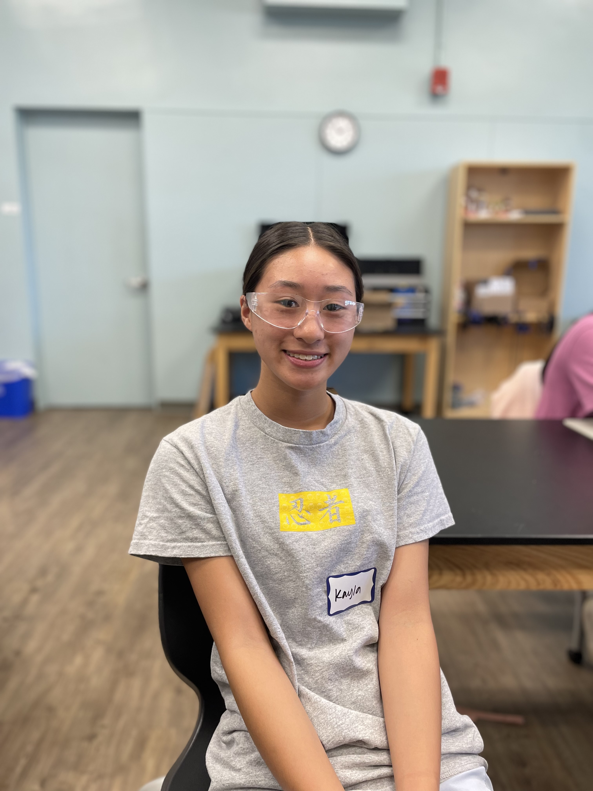
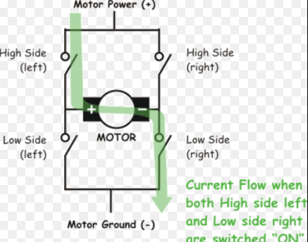
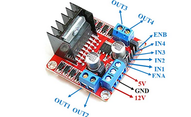
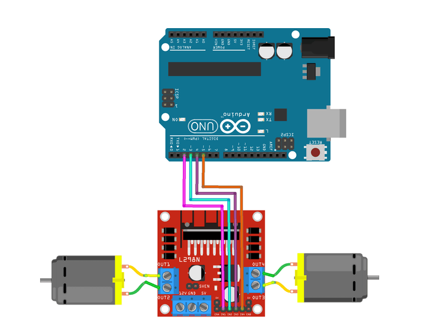
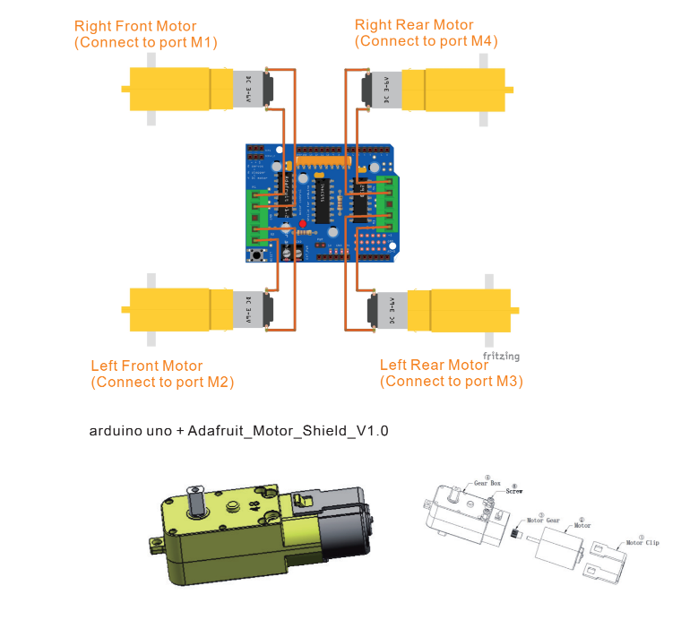
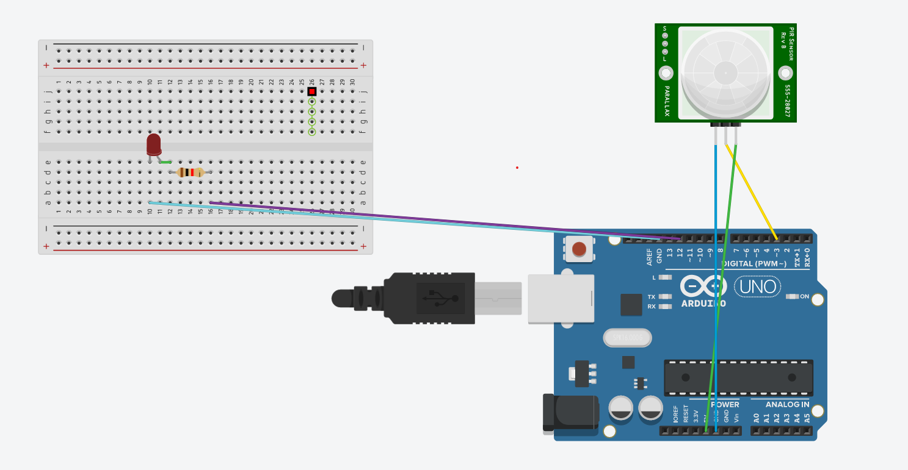
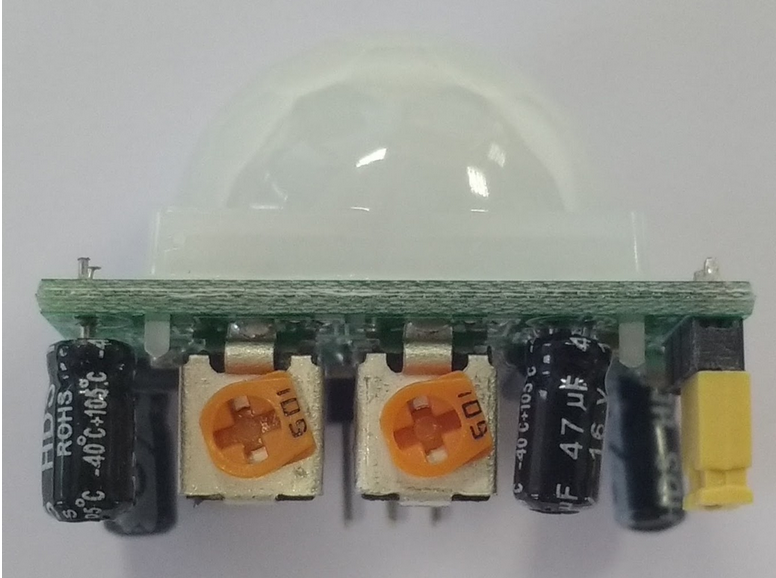

# Omniwheel
The omniwheel will be able to move in any direction: forward, backward, right, left, and even diagonally! Not only will it be able to move but also avoid obstacles in its way. Its wheels allow this "car" to move anywhere and avoid anything. 

<!---You should comment out all portions of your portfolio that you have not completed yet, as well as any instructions:
```HTML 
<!--- This is an HTML comment in Markdown -->
<!--- Anything between these symbols will not render on the published site 
```-->

| **Engineer** | **School** | **Area of Interest** | **Grade** |
|:--:|:--:|:--:|:--:|
| Kayla L | Saint Francis | Electrical Engineering | Incoming Senior

**Replace the BlueStamp logo below with an image of yourself and your completed project. Follow the guide [here](https://tomcam.github.io/least-github-pages/adding-images-github-pages-site.html) if you need help.**


  
<!---# Final Milestone

**Don't forget to replace the text below with the embedding for your milestone video. Go to Youtube, click Share -> Embed, and copy and paste the code to replace what's below.**

<iframe width="560" height="315" src="https://www.youtube.com/embed/F7M7imOVGug" title="YouTube video player" frameborder="0" allow="accelerometer; autoplay; clipboard-write; encrypted-media; gyroscope; picture-in-picture; web-share" allowfullscreen></iframe>

For your final milestone, explain the outcome of your project. Key details to include are:
- What you've accomplished since your previous milestone
- What your biggest challenges and triumphs were at BSE
- A summary of key topics you learned about
- What you hope to learn in the future after everything you've learned at BSE


# Second Milestone

**Don't forget to replace the text below with the embedding for your milestone video. Go to Youtube, click Share -> Embed, and copy and paste the code to replace what's below.**

<iframe width="560" height="315" src="https://www.youtube.com/embed/y3VAmNlER5Y" title="YouTube video player" frameborder="0" allow="accelerometer; autoplay; clipboard-write; encrypted-media; gyroscope; picture-in-picture; web-share" allowfullscreen></iframe>

For your second milestone, explain what you've worked on since your previous milestone. You can highlight:
- Technical details of what you've accomplished and how they contribute to the final goal
- What has been surprising about the project so far
- Previous challenges you faced that you overcame
- What needs to be completed before your final milestone 
-->

# First Milestone

<iframe width="560" height="315" src="https://www.youtube.com/embed/BwnA2dhK-hY?si=z6W67eEtSvusYkwm" title="YouTube video player" frameborder="0" allow="accelerometer; autoplay; clipboard-write; encrypted-media; gyroscope; picture-in-picture; web-share" referrerpolicy="strict-origin-when-cross-origin" allowfullscreen></iframe>

<!---For your first milestone, describe what your project is and how you plan to build it. You can include:
- An explanation about the different components of your project and how they will all integrate together
- Technical progress you've made so far
- Challenges you're facing and solving in your future milestones
- What your plan is to complete your project
-->
# Summary
The omni wheel robot has 4 motors; each pair of motors is controlled by a motor driver.  On the front of the driver, there are four input pins. Those pins are connected to the arduino, they tell the motors to either move forward or backward through the words, “HIGH” and “LOW”.  There are two output pins on each side of the motor driver; those are connected to the motors itself, giving it power and direction.

The motor drivers use H-bridges which is a circuit with four switches that are connected to the motor. Power from one side is opened while the other is closed; which is seen through the input pins. There is one path for current to flow through which makes my motors move forwards or backwards when “HIGH” or “LOW”. 

```c++
   digitalWrite(motor1pin1, HIGH);
   digitalWrite(motor1pin2, LOW);
   digitalWrite(motor2pin1, HIGH);
   digitalWrite(motor2pin2, LOW);
```
In this code, pin 1 is "opened" making the motors only move forwards, if I were to switch pin 1 to “LOW” and pin 2 to “HIGH”, the motors would move the opposite direction. 



The input pins are connected to the arduino which follows the code. So far, I've only made it move forward, but could change it to move backward later. I also added 5 batteries, which add to about 7.5 V so that the motors would get enough power to move all four wheels at the same speed. At first, the motors were not getting enough power since all the power was from the arduino which has a limit of 5 V. The motors each need about 2 V or less, so the batteries provided enough power for all of them. Later, I plan to put ultrasonic detectors around the robot so it can detect objects in its way, stop, and move around it. Through this first milestone, I learned how the motor drivers work, how to code a bit more, and the path of electricity in my circuit.


# Schematics 




# Code

```c++
int motor1pin1 = 5;
int motor1pin2 = 4;
int motor2pin1 = 3;
int motor2pin2 = 2;

int motor3pin1 = 6;
int motor3pin2 = 7;
int motor4pin1 = 8;
int motor4pin2 = 9;

void setup() {
     pinMode(motor1pin1, OUTPUT);
   pinMode(motor1pin2, OUTPUT);
   pinMode(motor2pin1, OUTPUT);
   pinMode(motor2pin2, OUTPUT);

  pinMode(motor3pin1, OUTPUT);
  pinMode(motor3pin2, OUTPUT);
  pinMode(motor4pin1, OUTPUT);
  pinMode(motor4pin2, OUTPUT);
}

void loop() {
   digitalWrite(motor1pin1, HIGH);
   digitalWrite(motor1pin2, LOW);
   digitalWrite(motor2pin1, HIGH);
   digitalWrite(motor2pin2, LOW);

  digitalWrite(motor3pin1, LOW);
  digitalWrite(motor3pin2, HIGH);
  digitalWrite(motor4pin1, LOW);
  digitalWrite(motor4pin2, HIGH);
}

```

<!---# Bill of Materials
Here's where you'll list the parts in your project. To add more rows, just copy and paste the example rows below.
Don't forget to place the link of where to buy each component inside the quotation marks in the corresponding row after href =. Follow the guide [here]([url](https://www.markdownguide.org/extended-syntax/)) to learn how to customize this to your project needs. 

| **Part** | **Note** | **Price** | **Link** |
|:--:|:--:|:--:|:--:|
| Item Name | What the item is used for | $Price | <a href="https://www.amazon.com/Arduino-A000066-ARDUINO-UNO-R3/dp/B008GRTSV6/"> Link </a> |
| Item Name | What the item is used for | $Price | <a href="https://www.amazon.com/Arduino-A000066-ARDUINO-UNO-R3/dp/B008GRTSV6/"> Link </a> |
| Item Name | What the item is used for | $Price | <a href="https://www.amazon.com/Arduino-A000066-ARDUINO-UNO-R3/dp/B008GRTSV6/"> Link </a> |

# Other Resources/Examples
One of the best parts about Github is that you can view how other people set up their own work. Here are some past BSE portfolios that are awesome examples. You can view how they set up their portfolio, and you can view their index.md files to understand how they implemented different portfolio components.
- [Example 1](https://trashytuber.github.io/YimingJiaBlueStamp/)
- [Example 2](https://sviatil0.github.io/Sviatoslav_BSE/)
- [Example 3](https://arneshkumar.github.io/arneshbluestamp/)

To watch the BSE tutorial on how to create a portfolio, click here. 
-->
# Starter Arduino PIR Motion Sensor

<iframe width="560" height="315" src="https://www.youtube.com/embed/gFlQUq_p7wg?si=AjYj2I2Vaek6ZTxY" title="YouTube video player" frameborder="0" allow="accelerometer; autoplay; clipboard-write; encrypted-media; gyroscope; picture-in-picture; web-share" referrerpolicy="strict-origin-when-cross-origin" allowfullscreen></iframe>

In this starter arduino project, I used the PIR Motion Sensor as my input and a LED as the output. The PIR motion sensor is able to make the LED light up because it is an infared sensor. This means it detects infrared light emitted from nearby objects. When detected, it sends a signal that causes the LED to turn on. All objects emit some type of infrared radiation which is translated as thermal energy that the PIR can pick up. It also uses two potentiometers that can focus on the time and distance of when to signal the output. These potentiometers can be moved clockwise to change how far an object it will detect and how much time for the LED to turn on. Potentiometers act as a resistor in the PIR. These can control the sensitivity of the sensors, and also the period of time for which the PIR will signal when motion is detected.This is all connected to the arduino which reads the code that instructs how the LED will turn on. It starts with the PIR state as "LOW" meaning off and when it detects motion the state will change to "HIGH" meaning on. This translates to the LED which will turn on and off based on the PIR's state. 

# Schematics




These are the potentiometers in the PIR. The one on the left controls the distance and sensitivity and the right controls the time.

# Code

```c++
int ledPin = 12;                // choose the pin for the LED
int inputPin = 3;               // choose the input pin (for PIR sensor)
int pirState = LOW;             // we start, assuming no motion detected
int val = 0;                    // variable for reading the pin status
 
void setup() {
  pinMode(ledPin, OUTPUT);      // declare LED as output
  pinMode(inputPin, INPUT);     // declare sensor as input
 
  Serial.begin(9600);
}
 
void loop(){
  val = digitalRead(inputPin);  // read input value
  if (val == HIGH) {            // check if the input is HIGH
    digitalWrite(ledPin, HIGH);  // turn LED ON
    if (pirState == LOW) {
      // we have just turned on
      Serial.println("Motion detected!");
      // We only want to print on the output change, not state
      pirState = HIGH;
    }
  } else {
    digitalWrite(ledPin, LOW); // turn LED OFF
    if (pirState == HIGH){
      // we have just turned of
      Serial.println("Motion ended!");
      // We only want to print on the output change, not state
      pirState = LOW;
    }
  }
}

```


